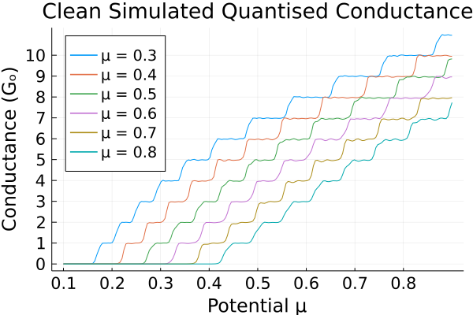
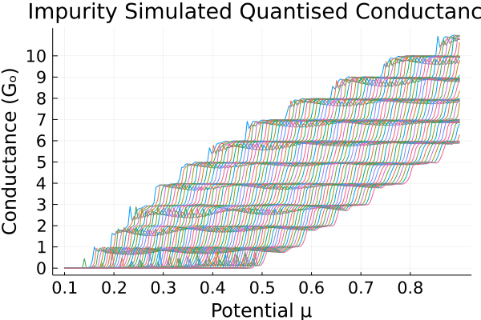
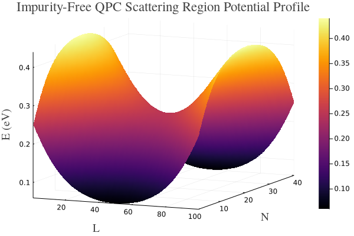
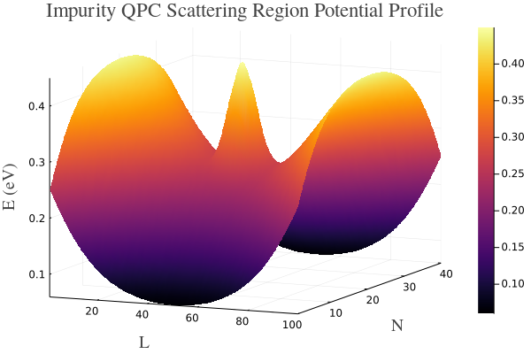

# Investigating Quantum Transport in Low-Dimensional Systems

__Clean:__

</img>

__Dirty:__

</img>

Simulating quantum transpoty in a quantum point contact device, using a scattering/NEGF form coupled with a Chalker-Caoddington network to compute the fermionic transmission coefficients across the cronstriction.

The potential drop in the scattering region was mapped for the cases where the device was clean (impurity-free) and dirty (containing ionic impurity).
A hyperbolic paraboloid was used for the clean maapping, whereaas a modified gaussian was used to model potential effects of the immpurity.

__Clean:__

</img>

__Dirty:__

</img>
